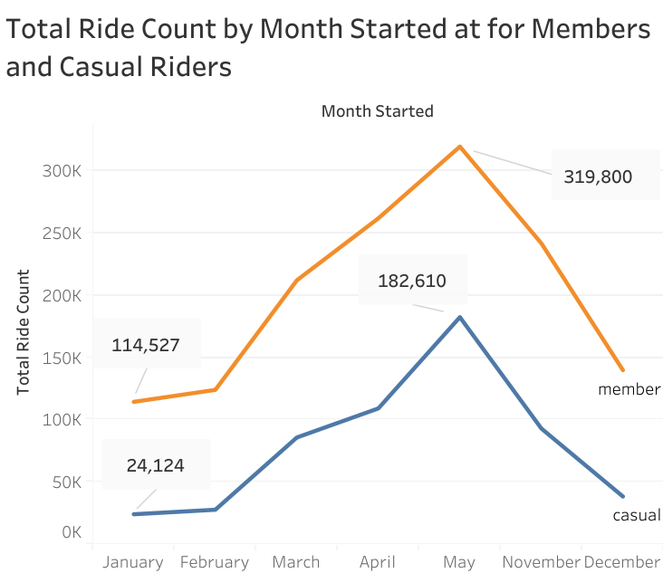
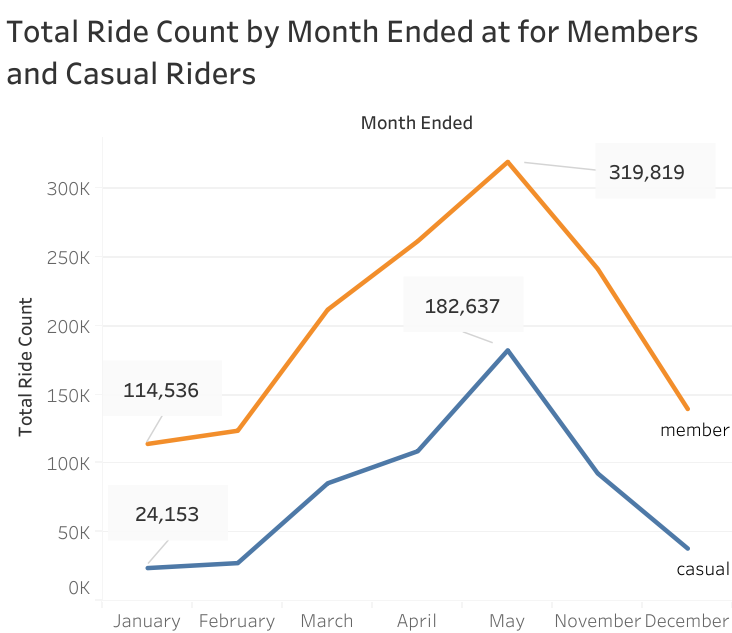

# Cyclistic Bike-Share: Data-Driven Membership Growth Strategy
**Author:** Ezennia Divine Onyedikachi  
**Date:** October 30, 2025  
**Case Study:** Google Data Analytics Capstone

---

## 📋 Project Overview
This project analyzes **1.97 million+** ride records (September 2024 – August 2025) to identify how behavioral differences between **casual riders** and **annual members** can be leveraged to drive membership conversions. By combining SQL-led data engineering with Tableau visualizations, I uncovered high-value opportunities for seasonal marketing and operational optimization.

## 🏗️ The Engineering Approach (Data Preparation)
To ensure **Engineering Rigor**, I prioritized data integrity and handled the high-volume dataset using BigQuery.

* **Scalability:** Merged 12 months of raw data using `UNION DISTINCT` to create a consolidated source of **1,975,968 unique records**.
* **Station Integrity:** Identified a significant data gap (18.4% start stations and 19.2% end stations missing). Instead of deleting these records—which would skew volume—I programmatically labeled them as "unknown" using `IFNULL()` and `TRIM()` to preserve the total ridership count.
* **Temporal Logic:** Corrected for system errors by using `LEAST()` and `GREATEST()` functions on ride timestamps, ensuring all trip durations were logically valid and non-negative.
* Geospatial Integrity: Identified null values in end_lat and end_lng (0.08% of dataset). These records were intentionally retained as the end_station_name was intact, ensuring no loss in ride-volume accuracy or station-to-station trend analysis.

## 🔍 Key Analytical Insights

### 1. Behavioral Segmentation: Utility vs. Recreation
* **Casual Riders:** Display "Recreational DNA," with trip durations peaking from Fridays to Sundays (often exceeding **1,400 seconds**).
* **Annual Members:** Show "Utility DNA," maintaining consistent, shorter trip lengths (~720 seconds) centered around workday commutes.

### 2. The "Spring Surge" Opportunity
My analysis identified a massive ridership peak between **March and May**.
* Member volume reached its highest point in May (**319,800 rides**).
* Casual ridership surged simultaneously (**182,610 rides**), identifying this window as the "Golden Hour" for conversion campaigns.

### The "Afternoon Peak"  
Both user segments are most active in the afternoon, with members accounting for 24% of total ride volume during this window, highlighting the importance of afternoon availability for conversion marketing.

## 💡 Strategic Recommendations

### 1. Targeted Seasonal Marketing
* **Spring Peak Campaign:** Launch heavy promotion between March and May to capture casual riders when their activity is highest.
* **Weekend Warrior Pass:** Create a specialized weekend-only or 3-day plan membership to bridge the gap for recreational casual users.

### 2. Operational & Experience Optimization
* **Demand Matching:** Reposition bike fleets toward recreational "hotspot" stations during afternoon peaks to meet casual rider demand.
* **In-App Savings Nudges:** Implement personalized notifications that calculate and show casual riders how much they would have saved if they had an annual membership.

### 3. Strategic Partnerships
* Align with **parks, museums, and tourism boards** to promote seasonal campaigns that tie bike-sharing to local recreational activities.

---

## 🛠️ Tech Stack
* **SQL (BigQuery):** Data mining, cleansing, and aggregation.
* **Tableau:** Interactive storytelling and visualization.
* **Google Colab:** Analytical documentation and workflow management.

## 📂 Project Navigation: Choose Your Journey

To accommodate different review styles, this repository is organized into specialized modules. Please select the path that best suits your interests:

| For Hiring Managers & Stakeholders | For Technical Reviewers & Data Engineers |
| :--- | :--- |
| 📄 **[Executive Summary (PDF)](./reports/Cyclistic_Bike_Share_Analysis_Nov2024_May2025.pdf)** Strategic findings with code hidden for clarity. | 💻 [Technical Summary (PDF)](./reports/Cyclistic_Bike_Share_Technical_Analysis_Nov2024_May2025.pdf) 📓 **[Live Analysis Notebook (Google Colab)](https://colab.research.google.com/drive/1zmmIZ4bSUanZvVA0g99coWQIpb5Svir1?usp=sharing)** Interact with the live Python environment and raw code. |
| 📊 **[Interactive Tableau Dashboard](https://public.tableau.com/app/profile/ezennia.divine/vizzes)** Full visual exploration of ride patterns. | 🛠️ **[SQL Pipeline (Modular Scripts)](./scripts/)** Clean, documented ETL scripts (Merge → Clean → Enrich → Analyze). |
| 🖼️ **[Key Insight Gallery](./visualizations/)** Direct access to the most impactful charts. | 📘 **[Data Dictionary & Schema](./data/)** Documentation of source metadata and variables. |

### 📈 Quick Insight: The Spring Surge
One of the most significant findings of this analysis was the "Spring Surge" among casual riders starting in March.

  
  
*Figure 1: Comparison of Member vs. Casual growth during the seasonal transition.*
